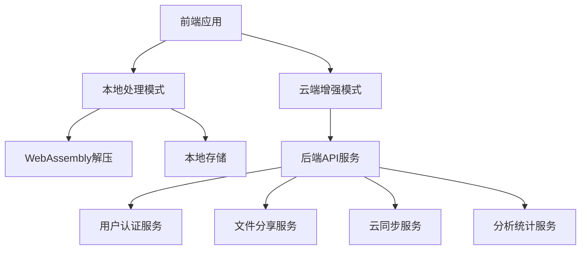

# ZhugeExtract 后端服务架构设计

## 架构概述

在保持现有纯前端优势的基础上，添加可选的后端服务支持，提供企业级功能和增强用户体验。

### 混合架构设计


## 技术栈选择

### 后端服务
- **运行时**: Node.js 18+ / Deno
- **框架**: Fastify / Hono (高性能)
- **数据库**: PostgreSQL + Redis
- **文件存储**: MinIO (S3兼容)
- **容器化**: Docker + Docker Compose
- **部署**: Kubernetes / Railway / Fly.io

### API设计
- **协议**: REST API + WebSocket
- **认证**: JWT + OAuth2
- **限流**: Redis + Sliding Window
- **文档**: OpenAPI 3.0 + Swagger

## 核心服务模块

### 1. 用户认证服务 (AuthService)
```typescript
interface AuthService {
  // 用户注册/登录
  register(userData: UserRegistration): Promise<AuthResult>
  login(credentials: LoginCredentials): Promise<AuthResult>
  
  // Token管理
  refreshToken(token: string): Promise<TokenResult>
  revokeToken(token: string): Promise<void>
  
  // 用户资料
  getProfile(userId: string): Promise<UserProfile>
  updateProfile(userId: string, data: ProfileUpdate): Promise<UserProfile>
}
```

### 2. 文件分享服务 (ShareService)
```typescript
interface ShareService {
  // 创建分享链接
  createShare(fileId: string, options: ShareOptions): Promise<ShareLink>
  
  // 访问分享文件
  accessShare(shareId: string, password?: string): Promise<SharedFile>
  
  // 管理分享
  listShares(userId: string): Promise<ShareInfo[]>
  updateShare(shareId: string, options: ShareOptions): Promise<ShareInfo>
  revokeShare(shareId: string): Promise<void>
}
```

### 3. 云同步服务 (SyncService)
```typescript
interface SyncService {
  // 文件上传
  uploadArchive(file: File, metadata: FileMetadata): Promise<UploadResult>
  
  // 同步状态
  getSyncStatus(userId: string): Promise<SyncStatus>
  syncFiles(userId: string): Promise<SyncResult>
  
  // 版本管理
  getFileVersions(fileId: string): Promise<FileVersion[]>
  restoreVersion(fileId: string, version: string): Promise<void>
}
```

### 4. 分析统计服务 (AnalyticsService)
```typescript
interface AnalyticsService {
  // 使用统计
  trackEvent(event: AnalyticsEvent): Promise<void>
  getUserStats(userId: string): Promise<UserStats>
  
  // 系统指标
  getSystemMetrics(): Promise<SystemMetrics>
  getUsageReport(timeRange: TimeRange): Promise<UsageReport>
}
```

## 数据库设计

### 用户表 (users)
```sql
CREATE TABLE users (
  id UUID PRIMARY KEY DEFAULT gen_random_uuid(),
  email VARCHAR(255) UNIQUE NOT NULL,
  username VARCHAR(50) UNIQUE NOT NULL,
  password_hash VARCHAR(255) NOT NULL,
  display_name VARCHAR(100),
  avatar_url TEXT,
  settings JSONB DEFAULT '{}',
  subscription_tier VARCHAR(20) DEFAULT 'free',
  created_at TIMESTAMP WITH TIME ZONE DEFAULT NOW(),
  updated_at TIMESTAMP WITH TIME ZONE DEFAULT NOW(),
  last_login_at TIMESTAMP WITH TIME ZONE
);
```

### 文件表 (files)
```sql
CREATE TABLE files (
  id UUID PRIMARY KEY DEFAULT gen_random_uuid(),
  user_id UUID REFERENCES users(id) ON DELETE CASCADE,
  original_name VARCHAR(255) NOT NULL,
  file_size BIGINT NOT NULL,
  format VARCHAR(10) NOT NULL,
  storage_path TEXT NOT NULL,
  metadata JSONB DEFAULT '{}',
  is_public BOOLEAN DEFAULT FALSE,
  created_at TIMESTAMP WITH TIME ZONE DEFAULT NOW(),
  updated_at TIMESTAMP WITH TIME ZONE DEFAULT NOW(),
  
  -- 索引
  INDEX idx_files_user_id (user_id),
  INDEX idx_files_format (format),
  INDEX idx_files_created_at (created_at)
);
```

### 分享表 (shares)
```sql
CREATE TABLE shares (
  id UUID PRIMARY KEY DEFAULT gen_random_uuid(),
  file_id UUID REFERENCES files(id) ON DELETE CASCADE,
  user_id UUID REFERENCES users(id) ON DELETE CASCADE,
  share_token VARCHAR(64) UNIQUE NOT NULL,
  password_hash VARCHAR(255),
  max_downloads INTEGER,
  current_downloads INTEGER DEFAULT 0,
  expires_at TIMESTAMP WITH TIME ZONE,
  created_at TIMESTAMP WITH TIME ZONE DEFAULT NOW(),
  
  -- 索引  
  INDEX idx_shares_token (share_token),
  INDEX idx_shares_file_id (file_id),
  INDEX idx_shares_expires_at (expires_at)
);
```

## API接口设计

### RESTful API结构
```
/api/v1/
├── auth/
│   ├── POST /register        # 用户注册
│   ├── POST /login          # 用户登录
│   ├── POST /refresh        # 刷新token
│   └── POST /logout         # 用户登出
├── users/
│   ├── GET /profile         # 获取用户资料
│   ├── PUT /profile         # 更新用户资料
│   └── GET /stats           # 用户统计
├── files/
│   ├── POST /upload         # 上传文件
│   ├── GET /list           # 文件列表
│   ├── GET /:id            # 文件详情
│   ├── DELETE /:id         # 删除文件
│   └── GET /:id/download   # 下载文件
├── shares/
│   ├── POST /create         # 创建分享
│   ├── GET /list           # 分享列表
│   ├── GET /:token         # 访问分享
│   ├── PUT /:id            # 更新分享
│   └── DELETE /:id         # 删除分享
└── sync/
    ├── GET /status         # 同步状态
    ├── POST /trigger       # 触发同步
    └── GET /conflicts      # 同步冲突
```

### WebSocket事件
```typescript
// 客户端 -> 服务端
interface ClientEvents {
  'sync:start': (userId: string) => void
  'share:access': (shareToken: string) => void
  'analytics:track': (event: AnalyticsEvent) => void
}

// 服务端 -> 客户端  
interface ServerEvents {
  'sync:progress': (progress: SyncProgress) => void
  'sync:complete': (result: SyncResult) => void
  'share:accessed': (shareInfo: ShareAccess) => void
  'notification': (notification: Notification) => void
}
```

## 服务实现

### 1. 核心后端服务
```typescript
// src/services/archive-backend.service.ts
import { FastifyInstance } from 'fastify'

export class ArchiveBackendService {
  constructor(
    private db: DatabaseService,
    private storage: StorageService,
    private auth: AuthService
  ) {}

  async uploadArchive(
    userId: string, 
    file: File, 
    metadata: FileMetadata
  ): Promise<UploadResult> {
    // 1. 验证用户权限
    await this.auth.validateUser(userId)
    
    // 2. 检查文件限制
    this.validateFileSize(file.size)
    this.validateFileFormat(metadata.format)
    
    // 3. 存储文件
    const storagePath = await this.storage.save(file)
    
    // 4. 保存元数据
    const fileRecord = await this.db.files.create({
      userId,
      originalName: metadata.name,
      fileSize: file.size,
      format: metadata.format,
      storagePath,
      metadata: metadata.structure
    })
    
    return {
      fileId: fileRecord.id,
      uploadTime: fileRecord.createdAt,
      storageUsed: file.size
    }
  }

  async createShare(
    userId: string,
    fileId: string,
    options: ShareOptions
  ): Promise<ShareLink> {
    // 1. 验证文件所有权
    const file = await this.db.files.findOne({
      id: fileId,
      userId
    })
    
    if (!file) {
      throw new Error('File not found or access denied')
    }
    
    // 2. 生成分享令牌
    const shareToken = this.generateSecureToken()
    
    // 3. 创建分享记录
    const share = await this.db.shares.create({
      fileId,
      userId,
      shareToken,
      passwordHash: options.password ? 
        await this.hashPassword(options.password) : null,
      maxDownloads: options.maxDownloads,
      expiresAt: options.expiresAt
    })
    
    return {
      shareId: share.id,
      shareUrl: `${process.env.BASE_URL}/share/${shareToken}`,
      token: shareToken,
      expiresAt: share.expiresAt
    }
  }
}
```

### 2. 实时同步服务
```typescript
// src/services/sync.service.ts
export class SyncService {
  private wsServer: WebSocketServer
  
  constructor() {
    this.wsServer = new WebSocketServer()
    this.setupEventHandlers()
  }
  
  async syncUserFiles(userId: string): Promise<SyncResult> {
    const localFiles = await this.getLocalFiles(userId)
    const cloudFiles = await this.getCloudFiles(userId)
    
    const conflicts = this.detectConflicts(localFiles, cloudFiles)
    const toUpload = this.getFilesToUpload(localFiles, cloudFiles)
    const toDownload = this.getFilesToDownload(localFiles, cloudFiles)
    
    // 发送同步进度
    this.broadcastToUser(userId, 'sync:progress', {
      stage: 'analyzing',
      progress: 25
    })
    
    // 执行同步
    await Promise.all([
      this.uploadFiles(userId, toUpload),
      this.downloadFiles(userId, toDownload)
    ])
    
    return {
      conflicts,
      uploaded: toUpload.length,
      downloaded: toDownload.length,
      totalSize: this.calculateTotalSize(toUpload, toDownload)
    }
  }
  
  private broadcastToUser(userId: string, event: string, data: any) {
    this.wsServer.to(`user:${userId}`).emit(event, data)
  }
}
```

### 3. 分析统计服务
```typescript
// src/services/analytics.service.ts
export class AnalyticsService {
  constructor(
    private db: DatabaseService,
    private redis: RedisService
  ) {}
  
  async trackEvent(event: AnalyticsEvent): Promise<void> {
    // 实时计数器更新
    await this.redis.incr(`events:${event.type}:${event.date}`)
    
    // 批量写入数据库
    await this.batchWrite({
      userId: event.userId,
      eventType: event.type,
      eventData: event.data,
      timestamp: new Date(),
      sessionId: event.sessionId
    })
  }
  
  async getUserStats(userId: string): Promise<UserStats> {
    const [
      fileCount,
      totalSize,
      shareCount,
      downloadCount
    ] = await Promise.all([
      this.db.files.count({ userId }),
      this.db.files.sum('file_size', { userId }),
      this.db.shares.count({ userId }),
      this.db.shares.sum('current_downloads', { userId })
    ])
    
    return {
      fileCount,
      totalSize,
      shareCount,
      downloadCount,
      lastSync: await this.getLastSyncTime(userId)
    }
  }
}
```

## 部署配置

### Docker Compose
```yaml
# docker-compose.yml
version: '3.8'

services:
  # 后端API服务
  api:
    build: ./backend
    ports:
      - "3000:3000"
    environment:
      - DATABASE_URL=postgresql://postgres:password@db:5432/zhuge_extract
      - REDIS_URL=redis://redis:6379
      - MINIO_ENDPOINT=minio:9000
      - JWT_SECRET=${JWT_SECRET}
    depends_on:
      - db
      - redis
      - minio
    volumes:
      - ./backend:/app
      - /app/node_modules
    command: npm run dev

  # PostgreSQL数据库
  db:
    image: postgres:15-alpine
    environment:
      - POSTGRES_DB=zhuge_extract
      - POSTGRES_USER=postgres
      - POSTGRES_PASSWORD=password
    volumes:
      - postgres_data:/var/lib/postgresql/data
      - ./database/init.sql:/docker-entrypoint-initdb.d/init.sql
    ports:
      - "5432:5432"

  # Redis缓存
  redis:
    image: redis:7-alpine
    ports:
      - "6379:6379"
    volumes:
      - redis_data:/data

  # MinIO对象存储
  minio:
    image: minio/minio:latest
    ports:
      - "9000:9000"
      - "9001:9001"
    environment:
      - MINIO_ACCESS_KEY=minioadmin
      - MINIO_SECRET_KEY=minioadmin
    volumes:
      - minio_data:/data
    command: server /data --console-address ":9001"

  # Nginx反向代理
  nginx:
    image: nginx:alpine
    ports:
      - "80:80"
      - "443:443"
    volumes:
      - ./nginx/nginx.conf:/etc/nginx/nginx.conf
      - ./nginx/ssl:/etc/nginx/ssl
    depends_on:
      - api

volumes:
  postgres_data:
  redis_data:
  minio_data:
```

### Kubernetes部署
```yaml
# k8s/deployment.yaml
apiVersion: apps/v1
kind: Deployment
metadata:
  name: zhuge-extract-backend
spec:
  replicas: 3
  selector:
    matchLabels:
      app: zhuge-extract-backend
  template:
    metadata:
      labels:
        app: zhuge-extract-backend
    spec:
      containers:
      - name: api
        image: zhuge-extract/backend:latest
        ports:
        - containerPort: 3000
        env:
        - name: DATABASE_URL
          valueFrom:
            secretKeyRef:
              name: db-secret
              key: url
        - name: REDIS_URL
          valueFrom:
            secretKeyRef:
              name: redis-secret
              key: url
        resources:
          requests:
            memory: "256Mi"
            cpu: "200m"
          limits:
            memory: "512Mi"
            cpu: "500m"
        livenessProbe:
          httpGet:
            path: /health
            port: 3000
          initialDelaySeconds: 30
          periodSeconds: 10
        readinessProbe:
          httpGet:
            path: /ready
            port: 3000
          initialDelaySeconds: 5
          periodSeconds: 5
```

## 监控和运维

### 健康检查
```typescript
// src/routes/health.ts
export async function healthCheck(fastify: FastifyInstance) {
  fastify.get('/health', async (request, reply) => {
    const checks = await Promise.allSettled([
      checkDatabase(),
      checkRedis(),
      checkStorage(),
      checkMemoryUsage()
    ])
    
    const status = checks.every(check => 
      check.status === 'fulfilled') ? 'healthy' : 'unhealthy'
    
    return {
      status,
      timestamp: new Date().toISOString(),
      checks: checks.map((check, index) => ({
        name: ['database', 'redis', 'storage', 'memory'][index],
        status: check.status === 'fulfilled' ? 'ok' : 'error',
        details: check.status === 'rejected' ? check.reason : null
      }))
    }
  })
}
```

### 性能监控
```typescript
// src/middleware/metrics.ts
export function metricsMiddleware() {
  const requestDuration = new prometheus.Histogram({
    name: 'http_request_duration_seconds',
    help: 'Duration of HTTP requests in seconds',
    labelNames: ['method', 'route', 'status']
  })
  
  return async (request: FastifyRequest, reply: FastifyReply) => {
    const start = Date.now()
    
    reply.addHook('onSend', async () => {
      const duration = (Date.now() - start) / 1000
      requestDuration
        .labels(request.method, request.routerPath, reply.statusCode.toString())
        .observe(duration)
    })
  }
}
```

这个后端架构设计为ZhugeExtract提供了可选的云端增强功能，同时保持了原有纯前端方案的优势。用户可以选择完全离线使用，或启用云端功能获得更多协作和分享能力。