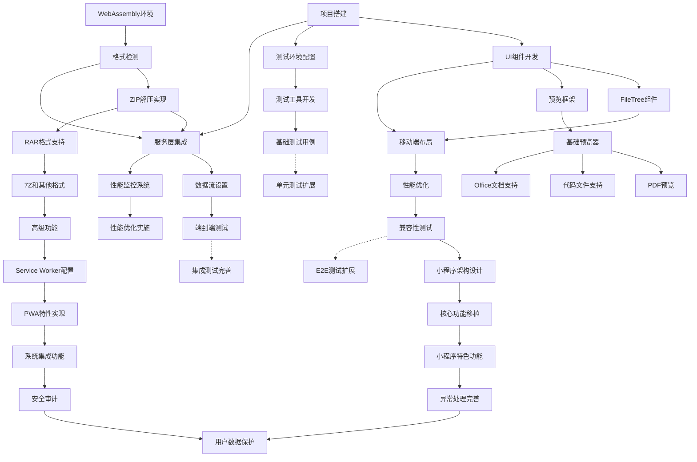

# ZhugeExtract 任务依赖关系矩阵

## 任务依赖关系图



## 详细依赖矩阵

### 第一阶段任务依赖 (2-4周)

| 任务ID | 任务名称 | 前置依赖 | 后续任务 | 并行任务 | 关键路径 |
|--------|----------|----------|----------|----------|----------|
| A1 | 项目搭建 | 无 | A2, C1, F1 | B1, C1 | ✅ |
| A2 | UI组件开发 | A1 | D1, E1, I1 | B2, C2 | ✅ |
| B1 | WebAssembly环境 | 无 | B2 | A1, C1 | ✅ |
| B2 | 格式检测 | B1 | B3, F1 | C2, A2 | ✅ |
| B3 | ZIP解压实现 | B2 | F1, G1 | C3, D1 | ✅ |
| C1 | 测试环境配置 | 无 | C2 | A1, B1 | - |
| C2 | 测试工具开发 | C1 | C3 | A2, B2 | - |
| C3 | 基础测试用例 | C2 | K1 | B3, D1 | - |
| D1 | FileTree组件 | A2 | I1 | B3, E1 | - |
| E1 | 预览框架 | A2 | E2 | D1, C3 | - |
| E2 | 基础预览器 | E1 | H1, H2, H3 | F1 | - |
| F1 | 服务层集成 | A1, B2, B3 | F2, J1 | E2 | ✅ |
| F2 | 数据流设置 | F1 | F3 | - | ✅ |
| F3 | 端到端测试 | F2 | K2 | - | ✅ |

### 第二阶段任务依赖 (4-6周)

| 任务ID | 任务名称 | 前置依赖 | 后续任务 | 并行任务 | 关键路径 |
|--------|----------|----------|----------|----------|----------|
| G1 | RAR格式支持 | B3 | G2 | H1, I1 | ✅ |
| G2 | 7Z和其他格式 | G1 | G3 | H2, I2 | ✅ |
| G3 | 高级功能 | G2 | M1 | H3, J2 | ✅ |
| H1 | PDF预览 | E2 | - | G1, I1 | - |
| H2 | 代码文件支持 | E2 | - | G2, I2 | - |
| H3 | Office文档支持 | E2 | - | G3, J1 | - |
| I1 | 移动端布局 | A2, D1 | I2 | G1, H1 | - |
| I2 | 性能优化 | I1 | I3 | G2, H2 | - |
| I3 | 兼容性测试 | I2 | L1 | G3, J2 | - |
| J1 | 性能监控系统 | F1 | J2 | H3, I1 | - |
| J2 | 性能优化实施 | J1 | - | G3, I3 | - |
| K1 | 单元测试扩展 | C3 | - | 持续任务 | - |
| K2 | 集成测试完善 | F3 | - | 持续任务 | - |
| K3 | E2E测试扩展 | I3 | - | 持续任务 | - |

### 第三阶段任务依赖 (6-8周)

| 任务ID | 任务名称 | 前置依赖 | 后续任务 | 并行任务 | 关键路径 |
|--------|----------|----------|----------|----------|----------|
| L1 | 小程序架构设计 | I3 | L2 | M1, N1 | - |
| L2 | 核心功能移植 | L1 | L3 | M2, N2 | - |
| L3 | 小程序特色功能 | L2 | N2 | M3 | - |
| M1 | Service Worker配置 | G3 | M2 | L1, N1 | ✅ |
| M2 | PWA特性实现 | M1 | M3 | L2, N2 | ✅ |
| M3 | 系统集成功能 | M2 | N1 | L3 | ✅ |
| N1 | 安全审计 | M3 | N3 | L1 | - |
| N2 | 异常处理完善 | L3 | N3 | M2 | - |
| N3 | 用户数据保护 | N1, N2 | - | - | - |

## 关键路径分析

### 主关键路径 (影响项目总工期)
```
A1 → A2 → F1 → F2 → F3 → G1 → G2 → G3 → M1 → M2 → M3 → N1 → N3
总耗时: 约12-16周
```

### 次要关键路径
```
B1 → B2 → B3 → G1 (与主路径汇合)
A2 → D1 → I1 → I2 → I3 → L1 → L2 → L3 → N2 → N3
```

## 资源分配建议

### 第一阶段 (2-4周)
```
前端架构师: A1 → A2 → F1 → F2 → F3
解压缩开发: B1 → B2 → B3
UI开发: 等待A2完成后 → D1, E1 → E2
测试开发: C1 → C2 → C3
```

### 第二阶段 (4-6周)
```
解压缩开发: G1 → G2 → G3 (关键路径)
文件处理开发: H1, H2, H3 (并行)
移动端开发: I1 → I2 → I3
前端架构师: J1 → J2
测试开发: K1, K2, K3 (持续)
```

### 第三阶段 (6-8周)
```
前端架构师: M1 → M2 → M3 (关键路径)
移动端开发: L1 → L2 → L3
全团队: N1, N2 → N3
```

## 风险控制点

### 🔴 高风险依赖
1. **B2 → B3**: 格式检测失败会阻塞ZIP解压
2. **F1**: 服务层集成是多个模块的汇合点
3. **G1 → G2**: RAR解压复杂度可能超预期
4. **M1 → M2**: PWA功能可能遇到浏览器兼容问题

### 🟡 中风险依赖
1. **A2 → D1, E1**: UI组件延迟会影响多个功能
2. **I2 → I3**: 移动端性能优化可能需要多轮迭代
3. **L1 → L2**: 小程序架构选择影响后续开发

### ⚠️ 缓解策略
1. **提前风险识别**: 在依赖任务开始前评估风险
2. **并行预研**: 高风险任务提前进行技术预研
3. **降级方案**: 为关键路径任务准备备选方案
4. **资源调配**: 关键任务可临时增加人力

## 里程碑检查点

### Week 2: 基础架构里程碑
- **必须完成**: A1, B1, C1
- **预期完成**: A2, B2, C2
- **检查指标**: 项目可运行，基础UI展示，格式检测正常

### Week 4: MVP功能里程碑  
- **必须完成**: F3 (端到端测试通过)
- **预期完成**: D1, E2, C3
- **检查指标**: ZIP文件完整解压预览流程

### Week 8: 功能完善里程碑
- **必须完成**: G3, I3
- **预期完成**: H1-H3, J2
- **检查指标**: 多格式支持，移动端适配完成

### Week 12: 最终交付里程碑
- **必须完成**: N3
- **预期完成**: M3, L3
- **检查指标**: 全平台支持，安全审计通过

这个任务依赖矩阵帮助团队清晰地了解任务之间的关系，合理安排开发顺序，避免因依赖关系导致的开发阻塞。